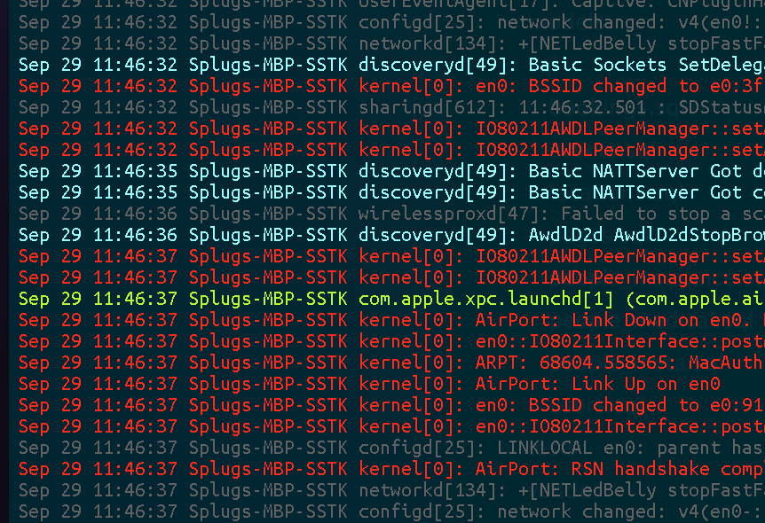

ninetails
=========

An output filtering extension for log files, and can be modified for a lot of things ;)

## Usage
-------------

Ninetails works simple out of the box. Just run:

    ninetails /log/file

It will automagically start working!

If you would like to tail the end of the file, you can pass an argument like:

    ninetails -t /log/file

or

    ninetails -t200 /log/file

If you enable exact matching with the `-e` flag, you can create a REGEX filter to match text.

    
## Syntax Coloring

You can create a python dictionary like so:

    colors = {
        'RED':  ['sudo', 'kernel'],
        'ORANGE': ['login'],
        'GREEN':  ['py', 'php', 'launch'],
        'BABYBLUE':  ['discoveryd']
    }

## Screenshot
-------------

## Colors
---------

    PURPLE    = "\033[38;5;129m"
    PINK      = "\033[38;5;162m"
    RED       = "\033[38;5;196m"
    ORANGE    = "\033[38;5;208m"
    YELLOW    = "\033[38;5;184m"
    GREEN     = "\033[38;5;154m"
    BLUE      = "\033[38;5;32m"
    GREY      = "\033[38;5;242m"
    DARKGREY  = "\033[38;5;239m"
    LIGHTGREY = "\033[38;5;249m"
    BABYBLUE  = "\033[38;5;123m"
    LIGHTPINK = "\033[38;5;212m"
    WHITE     = "\033[38;5;7m"
    CLEAR     = "\033(B\033[m" #$(tput sgr0)
